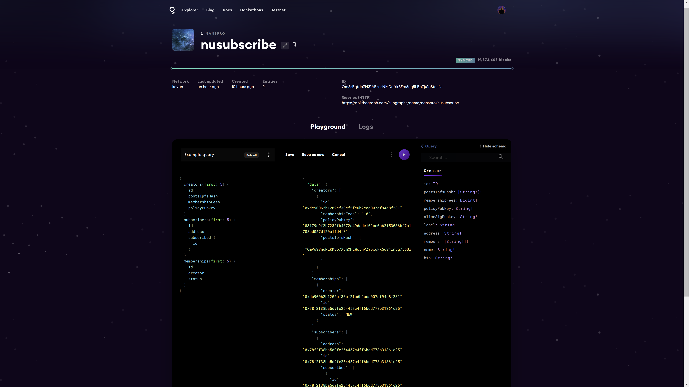
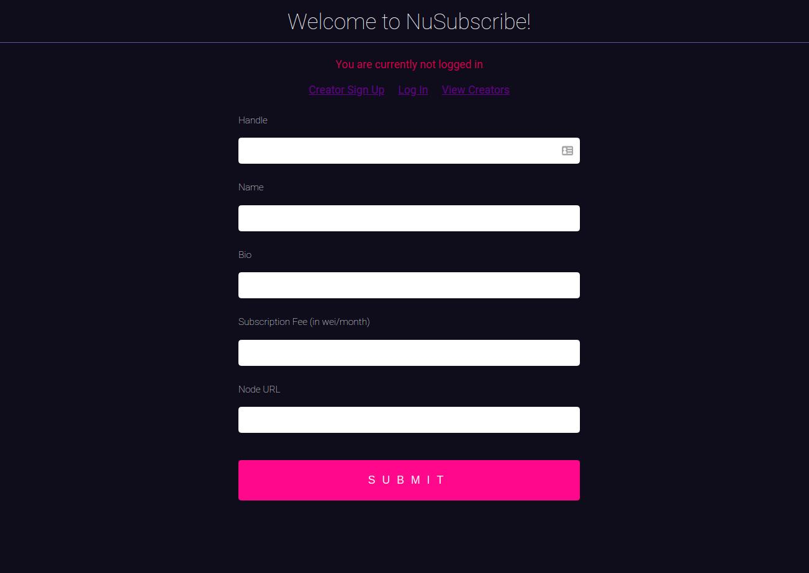
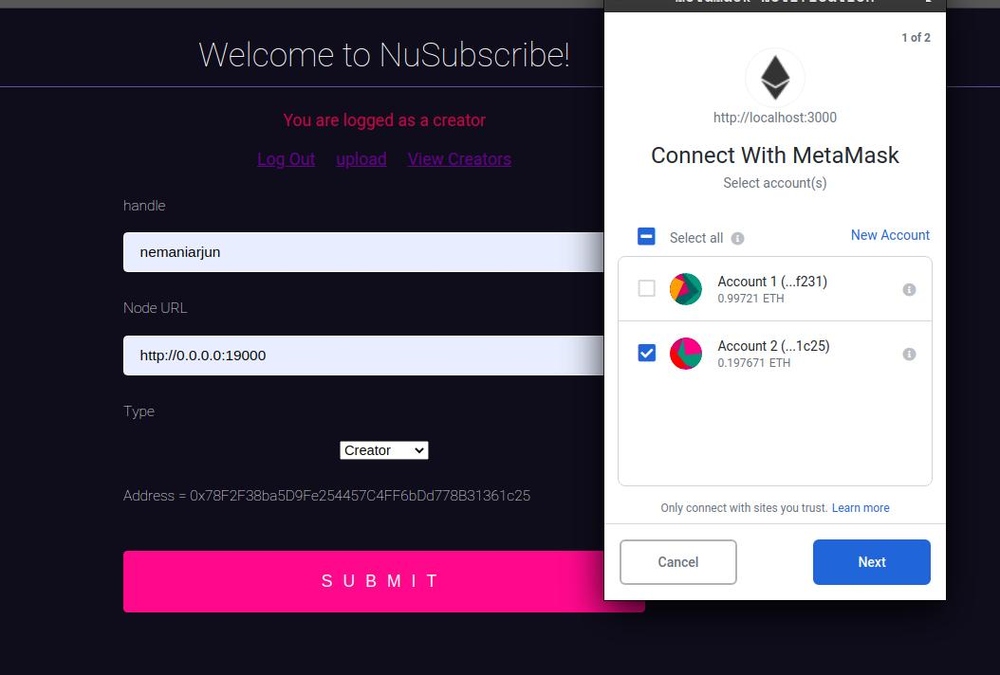
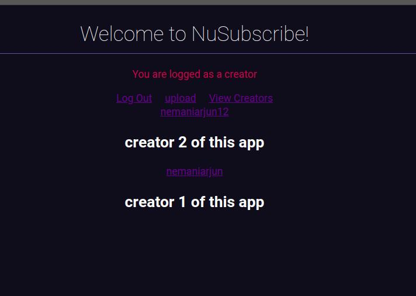
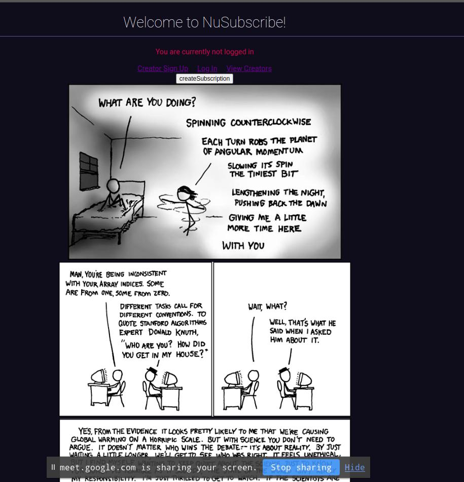

# nuSubscribe
An application where users can sponsor their favourite creators and subscribe to their content. Built on nucypher! 

## How it Works
- Creators and buyers will be running their nuCypher nodes, address of which will be entered upon login
- FE talks to creator's nucypher node and obtains policy info's ipfsHash which then gets submitted to our smart contract.
- Creator is now registered on our contract so after that he is now able to create posts. Every post gets encrypted locally on his node and gets pushed to ipfs. We post that hash to our smart contracts.
- Buyers don't go through any registration process cause we don't need any information from buyer other than that they want to support the creator, however with creator we decided to take some info like bio, name etc to reduce spam.
- Buyers pay creator's membership fees which goes to our smart contract and gets released to buyer only once they have been granted access. Currently we don't support any dispute resolution cause it felt out of the scope of hackathon to introduce oracles here but this could be a feature later on.
- Creators can see who all paid membership fees to the contract and then they can grant them access for a month.

### Using graph protocol for better UX
We created a subgraph for our smart contracts so that we can show relevant information to creators and buyers easily. The graph is deployed here https://thegraph.com/explorer/subgraph/nanspro/nusubscribe
- Using graph we show a creator all the buyers who paid membership fees and are waiting for access
- Buyer entity maintains state (pending access, approved) to see which of his subscriptions are approved or not
- Buyers can see all creators he is subscribed to
- Creators can see all their members and posts

## How to run locally

### Smart Contracts
```
cd contracts
yarn
truffle compile
truffle migrate -- reset --network development
```

Deployed Contract on kovan: `0x104c64a7293d41411b9e2046c3b8e7710287753f`

### Graph
You can view the graph here: https://thegraph.com/explorer/subgraph/nanspro/nusubscribe


```
cd packages/subgraph
yarn
yarn deploy
```

### React App
```
cd packages/react-app
yarn start
```




### NuCypher
- In the shell that opens run ursulas using `nucypher ursula run --dev --federated-only --rest-port 11500 &` and `nucypher ursula run --dev --federated-only --rest-port 11501 --teacher localhost:11500 &`

- Next we run nuCypher/creator_server/server.py and nuCypher/buyer_server/server.py creator and buyer servers

- We pass the node url to FE while signing up so that FE can talk to these servers and operations such as encryption and decryption happens locally on user's machine without compromising any keys





## Challenges Faced
- Frequent failure of ursulas with hard to understand errors. It was not possible to understand what went wrong without being extremely familiar with nuCypher as the errors usually didn't make sense at once. So the only option was to restart the whole network again and again which sometimes changed alice's keys and stuff resulting in all contract calls again

- It's hard to send nuCypher related data through apis so we had to structure it properly all the time. Like for ex:
```python
bobpubkeys["enc"] = UmbralPublicKey.from_bytes(bytes.fromhex(bob_pub_keys["enc"]))
bobpubkeys["sig"] = UmbralPublicKey.from_bytes(bytes.fromhex(bob_pub_keys["sig"]))
```
- One of the most important things which could be improved with nuCypher is allowing nuCypher related operations from browser itself instead of writing a new backend server with rest apis everytime we want to interact with nuCypher. Interaction with nuCypher from scripts is super easy and amazing but when you try to interact through apis it becomes so cumbersome because of frequent errors due to improper formatting of data, ursulas failing for no reason (probably due to corrupt data or we are not sure).
